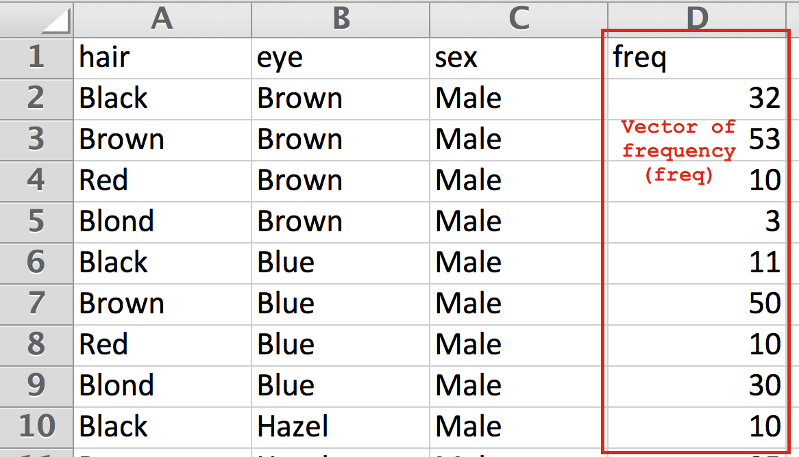

# Lecture 5 Exercises

Today, you'll complete 3 exercises that cover the following skills:

- Loading data that comes with the R package
- Reading data using the `read.csv` function
- Saving files using the `write.csv` function
- Writing functions to ask questions of your data
- Working with vectors

Following each exercise, a TA will show the answers, and field any questions.  Please read each section below, and then complete the exercise.

## Data Frames
A typical form of working with data is in a tabular (row, column) format.  This should be relatively familiar from using programs like Microsoft Excel or Google Sheets.  A common format for these files to be saved in is a **comma separated values** (`.csv`) file.  This file stores the raw values (numbers, strings) in a text-file, but without any formatting you may have added (**bold**, *italics*, etc.). 

You can read a `.csv` file into R using the `read.csv` function as follows:

```
# Read your dataframe into a variable `my_data`
my_data <- read.csv('file_name.csv')
```

You can store this data into a `data.frame` variable, which we'll learn more about in the next lecture.  

The important information for today is that **each column of your data.frame is a vector** (usually), which you already know how to manipulate.  For example, in the image below, you could read in a `data.frame` of this spreadsheet, which would have 4 columns (which you can manipulate as vectors).



If this file were saved from excel as `students.csv`, we could read it in and access the `freq` column as follows

```
# Read in student data into a variable
student_data <- read.csv('students.csv')

# Store the `freq` column as a vector 
freq <- student_data$freq

```

Then, you will be able to perform the vector operations as you're already familiar with.  We'll learn ways to directly manipulate `data.frame` variable, but the focus for this class is reading/writing data, and working on our vector operations.

## Exercise 1
In this exercise, you'll work with data that details education grants awarded by the Gates Foundation between 2008 and 2010.  Once you read in the data, you'll use vector operations you already know to ask real questions about the dataset. 

In order to perform better memory allocation and analysis, `data.frame` variables store vectors of strings as **factor** variables ([more info](http://www.ats.ucla.edu/stat/r/modules/factor_variables.htm)).  For our purposes, these can be easily converted into vectors:

```
# From the example above: read a data.frame column as a vector 
vector_var <- as.vector(students$hair)
```
## Exercise 2
In this exercise, you'll work with a dataset that has the popularity (proportion) of each female name in the United States from 1961 - 2013.  Here, you'll write functions that allow you to ask relevant questions of your dataset.  Note, the process of creating multiple vectors here **is not how you'll typically work with data.frames**, but allows us to continue practicing working with vectors.  We'll introduce more direct methods in the upcoming lectures.  One new approach you'll use here is using one vector to identify the indicies of another vector.  Consider the following example:

```
# A vector of salaries
salaries <- c(30000, 50000, 20000, 10000, 80000)

# A vector of names of workers
names <- c('Steve', 'Anita', 'Rashmi', 'Sam', 'Allen')

# Names of people with salaries below 25000
lower_salary_names <- names[salaries<25000]
```

Note, you'll once again need to use your `as.vector` conversion when reading in string variables.

## Exercise 3
In this exercise, you'll work with a dataset that comes pre-loaded in the R package.  This dataset has information on the hair color, eye color, and gender of students that participated in a statistics course.  In this exercise, you'll learn how to create `.csv` files using the `write.csv` function.  This would allow you to share your data with others, or use it in another software program.   